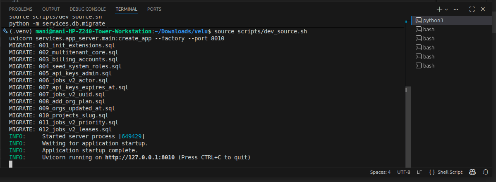
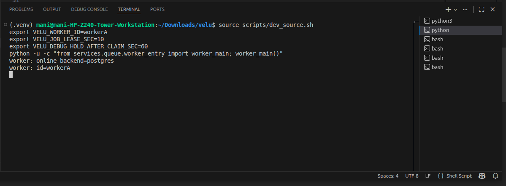
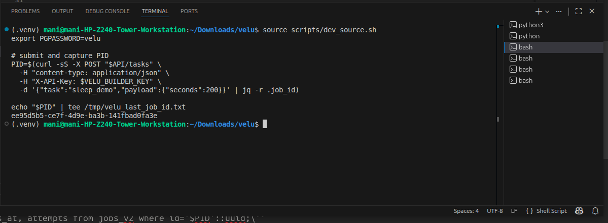
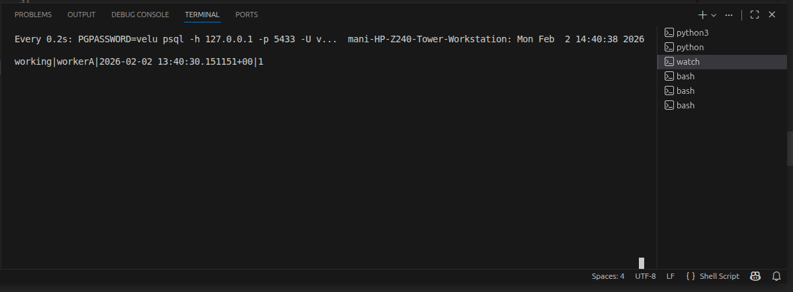
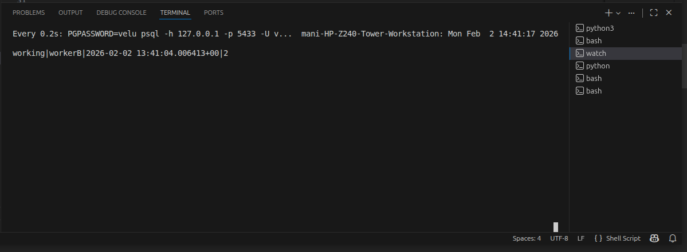
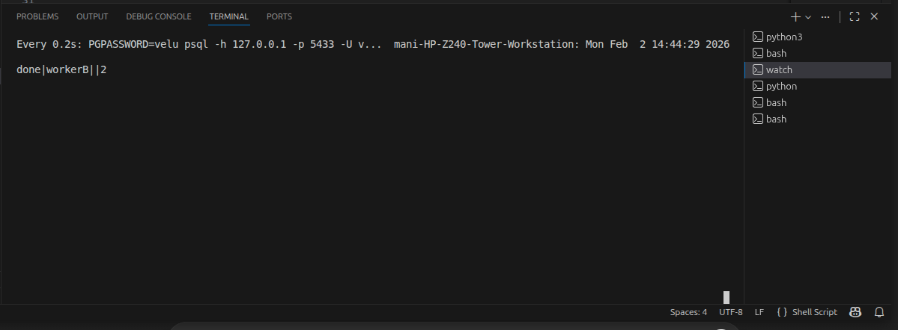

# Postgres Job Leasing Demo (Crash Recovery)

This demo proves that the queue is **safe for multi-worker / multi-node execution**.

## Guarantees demonstrated

✔ Atomic claim (`FOR UPDATE SKIP LOCKED`)  
✔ Lease-based execution (`lease_expires_at`)  
✔ Worker crash does NOT lose jobs  
✔ Another worker safely reclaims unfinished work  

---

## Demo Steps

1. Start API
2. Start workerA
3. Submit long-running job
4. Job is claimed by workerA
5. Start workerB
6. Kill workerA (simulate crash)
7. After lease expiry → workerB reclaims job
8. Job finishes successfully

---

## Screenshots

### 01 — API running


### 02 — workerA started


### 03 — workerB started


### 04 — job submitted


### 05 — claimed by workerA


### 06 — reclaimed by workerB


### 07 — finished successfully


---

## Watch command used

```bash
watch -n 0.2 "PGPASSWORD=velu psql -h 127.0.0.1 -p 5433 -U velu -d velu_main -Atc \
\"select status, claimed_by, lease_expires_at, attempts from jobs_v2 where id='<uuid>'::uuid;\""

